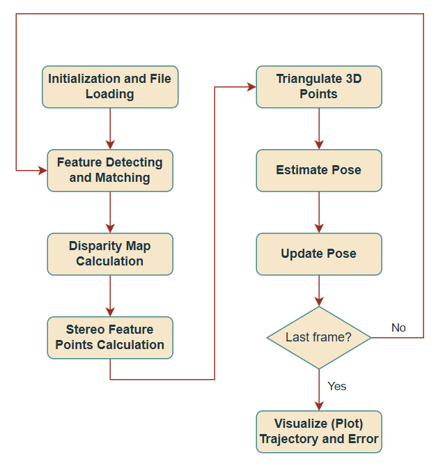

# **Visual-Inertial Odometry**

## **Description**
This is a thesis project done in the W2025 semester by James Nguyen. It focuses on the comparison between monocular and stereo visual odometry. An attempt to incorporate Extended Kalman Filters was made to fuse visual and IMU data.

## **Table of Contents**
1) [Monocular Visual Odometry Algorithm Overview](#monocular-visual-odometry-algorithm-overview)

2) [Stereo Visual Odometry Algorithm Overview](#stereo-visual-odometry-algorithm-overview)

3) [Stereo Visual Odometry Functions Overview](#stereo-visual-odometry-functions-overview)

4) [Inertial Odometry Functions Overview](#inertial-odometry-functions-overview)

5) [Visual-Inertial Odometry Algorithm Overview](#visual-inertial-odometry-algorithm-overview)

6) [Hardware Implemenation](#hardware-implementation)

## **Monocular Visual Odometry Algorithm Overview**

## **Stereo Visual Odometry Algorithm Overview**
The main objective of this algorithm is to estimate the camera's motion (trajectory) from stereo images using visual odometry

- **Initialization**
    - Loading Calibration, Images, and Ground Truth
    - Disparity Map Initialization
    - Feature Detector and Matcher Initialization

- **Pipeline for Each Frame**
    - Feature Detecting and Matching
    - Disparity Map Calculation
    - Calculate Stereo Feature Points
    - Triangulate 3D Points
    - Estimate Pose
    - Update Pose

- **Post-Processing and Visualization**
    - Error Calculation
    - Visualization via Plots

    

## **Stereo Visual Odometry Functions Overview**
- **_load_calib(filepath)**
    - loads the projection matrices in the .txt file and extracts the intrinsic matrices from the projection matrices for the left and right camera which are used to transform 3D points into image space and calculate disparities
    - intrinsic parameters describe the internal characteristics of the camera (focal length, pixel size, optical center) which are used to map 3D points in the camera's filed of view to 2D pixel coordinates
    - projection matrices descrive how 3D points are projected into 2D image space for for each camera

- **_load_poses(filepath)**
    - reads the ground truth poses (4x4 transformation matrices) for evaluation and visualization
    - this function is used for KITTI sequences 0-10

- **_load_images(filepath)**
    - loads the grayscale images from the dataset for both left and right cameras

- **reprojection_residuals(self, dof, q1, q2, Q1, Q2)**
    - to calculate the reprojection residuals which measure how well 3D points project back into the 2D image points under a given camera transformation
    - the reprojection residulas quantify the difference between:
        - the observed 2D feature points inan image (q1 and q2)
        - the producted 2D feature points obtained by projecting 3D points back onto the images using a camera transformation (T)
    - in visual odometry, reprojection residuals help verify:
        - if the estimated camera pose is accurate
        - if the 3D points and camera transformations are consistent with the observed 2D image points
        - also checks the quality of the transformation (dof - degrees of freedom) between two frames; if the residuals are small, the transformation is accurate, and if they are large, the transformation needs refinement 

- **calculate_right_qs(self, q1, q2, disp1, disp2, min_disp = 0.0, max_disp = 100.0)**
    - used to compute feature points and their corresponding disparity values for stereo images (left and right) in consecutive frames
    - it ensures that feature points in both images are valid based on disparity values
    - creates a mapping between feature points in the left image (q1_l, q2_l) and the corresponding feature points in the right image (q1_r, q2_r) using disparity

- **get_idxs(q, disp)**
    - subfunction in calculate_right_qs
    - retrieves disparity values at the feature point coordinates (q) from the disparity map (disp)
    - applies a mask to filter points whose disparity values are within the given range

- **calc_3d(self, q1_l, q1_r, q2_l, q2_r)**
    - takes the 2D feature points in the left and right images of two consecutive frames and computes their 3D coordinates in the world using triangulation
    - triangulation computes the 3D position of a point by using its 2D projections in two images with the camera's intrinsic and extrinsic parameters

- **estimate_pose(self, q1, q2, Q1, Q2, max_iter = 100)**
    - estimates the transformation matrix between two frames based on a features points and their 3D positions
    - also performs least squares optimation which uses the reprojection_residuals functions
        - will calculate the error for the optimized transformation and will measure how well the optimized transformation aligns with the points

- **match_features(self, img1, img2)**
    - identifies corresponding points in two images based on feature descriptors and matches them
    - this function matches keypoints (feature points) between two images by:
        - detecting and describing keypoints in both images
        - matching the descriptors between the two images using K-nearest neighbor (k-NN) approach
        - filtering the matches to keep only the "good matches"
        - returning the 2D coordinates of the matched points in both images

- **get_pose(self, i)**
    - calculates the transformation matrix for the ith frame which describes the camera's motion (rotation and translation) between consecutive frames
    - the high level process is:
        1) get consecutive frames
        2) match features
        3) compute disparity map for depth estimation
        4) compute the corresponding points in the right images using disparity values
        5) calculate the 3D points
        6) estimate transformation matrix

- **visualize_paths_with_error_and_rotation(gt_path, estimated_path, rotation_errors, title="Visual Odometry Path with Error")**
    - provides visualization of the ground truth vs. estimated trajectories and provides translation and rotational errors

## **Inertial Odometry Functions Overview**

## **Visual-Inertial Odometry Algorithm Overview**

## **Hardware Implemenation**
